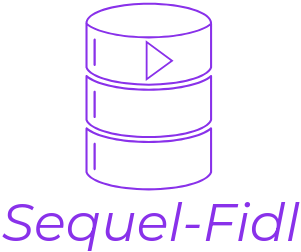

# Sequel-Fidl

  

A Local Electron Based plug and play gui solution that allows you to spin up any database and run some queries.

In the long run it aims to rival gui db clients like sequel pro with a more refreshed ui and same set of features.

# Contents

// todo

# Requirements

Installation Requirements are as follows :

-   Mac/Linux/Windows device
-   With Docker installed as well as the DOCKER cli
